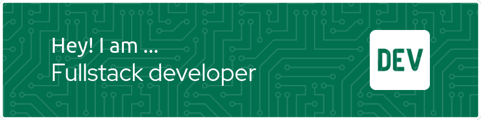
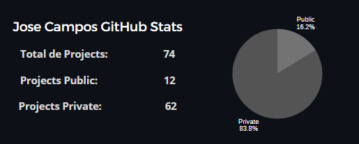

# 🌐 Redes Sociales:
 

# 💼 Acerca de mi:
¡Hola! 🙋🏽‍♂️😄 Es un honor tenerte aquí. Permíteme presentarme y compartir contigo mi trayectoria hacia el éxito profesional 👨🏽‍💻🚀:

▶️ CONOCIMIENTOS Y HABILIDADES 🔍◀️

🏛 Estudiante del X ciclo en Ingeniería de Sistemas, Universidad Nacional de Cañete. 
🌎 Pasantía internacional en Ciudad de Panamá, enriqueciendo mi perfil global. 
🖥️ Especialización en CJAVA - PERÚ, centrado en el desarrollo Full Stack. 

▶️ MI EXPERIENCIA PROFESIONAL 🧰◀️

🕒 Con más de tres años de experiencia, he fortalecido significativamente mis habilidades en análisis de sistemas y diseño de software. 
🤝 Este periodo me ha permitido trabajar en una variedad de proyectos, aplicando tecnologías avanzadas y metodologías ágiles para entregar soluciones efectivas y eficientes. 
🖥 He colaborado con diversos departamentos, mejorando procesos y fomentando la innovación tecnológica. 

▶️ MÁS ALLÁ DE LA TECNOLOGÍA🌱◀️

🏆 Entusiasta del ajedrez y representante de mi universidad en este deporte, me destaco por mi disciplina y perseverancia, elementos clave para lograr el éxito tanto en el tablero como en la vida.

▶️ CONTACTO📬◀️

😉 Si deseas conocer más sobre mí o contactarme, no dudes en escribirme a mi correo electrónico: ✉ joseluiscampostorres10@gmail.com o llamarme al 📱 +51940746627.

GRACIAS POR VISITAR MI PERFIL 🌟🎉 Espero que tengas un día increíble. Recuerda que los obstáculos son solo escalones hacia tus metas 👨🏽‍💻📌. ¡Continúa avanzando hacia el éxito!

# 💻 Tech Stack:

  

 
 

 

 

# 📊 Proyectos en GitHub:

